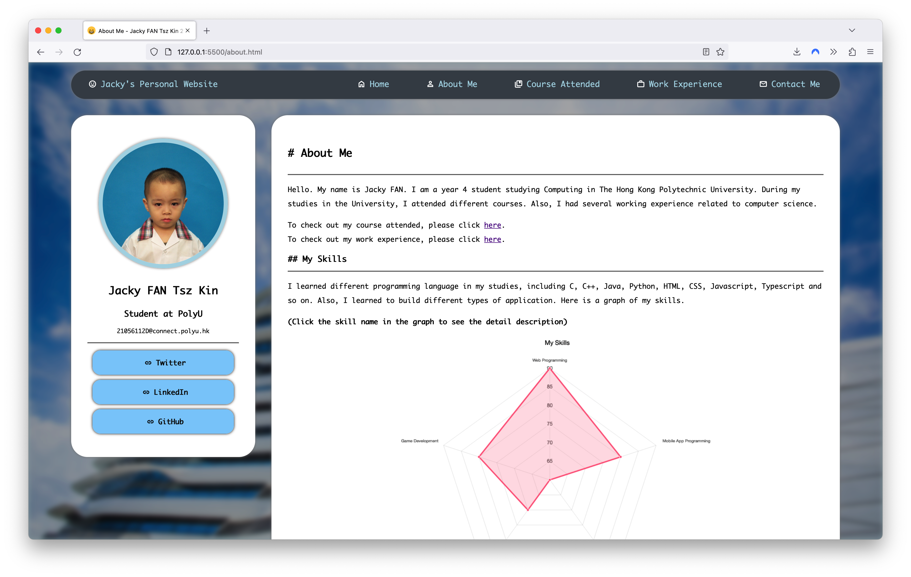
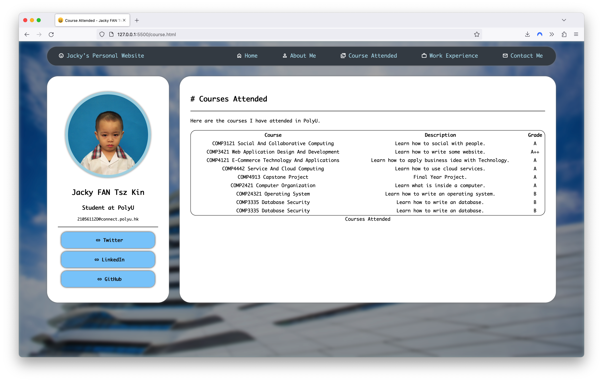
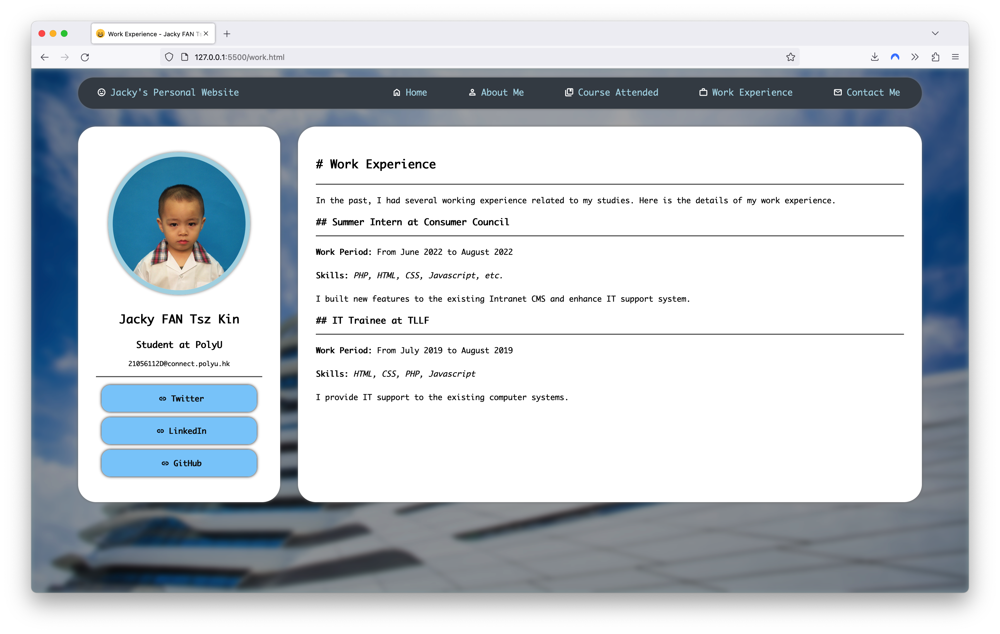
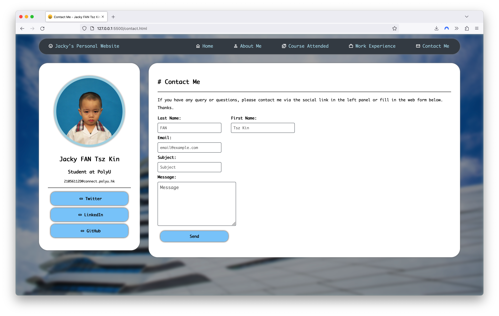

(Demo: access via https://comp3421-web.jacky.fan)

# comp3421-personal-website

A personal website built with plain HTML5 and CSS3 for Mid-Project of COMP3421 Web Application Design and Development.

## Features
- [x] Title on the page
- [x] Name on the page
- [x] Picture on the page
- [x] Good Introduction on the `About Me` page
- [x] A table on the `Course Attended` page
- [x] A frame in the `Linux` section of the `About Me` page
- [x] Images across the page, including navbar, `About Me` Page and the `Home` page.
- [x] Image Map in the `My Skills` section of the `About Me` page
- [x] a HTML `mailto` Form in the `Contact Me` pag
- [x] Blurred background image
- [x] Beautiful UI and animation
- [x] Favicon
- [x] etc.

## Screenshots
- Home Page

- About Me Page

- Course Attended Page

- Work Experience Page

- Contact Me Page

## Learn More
This website is built with the following tech:
- HTML5
- CSS
